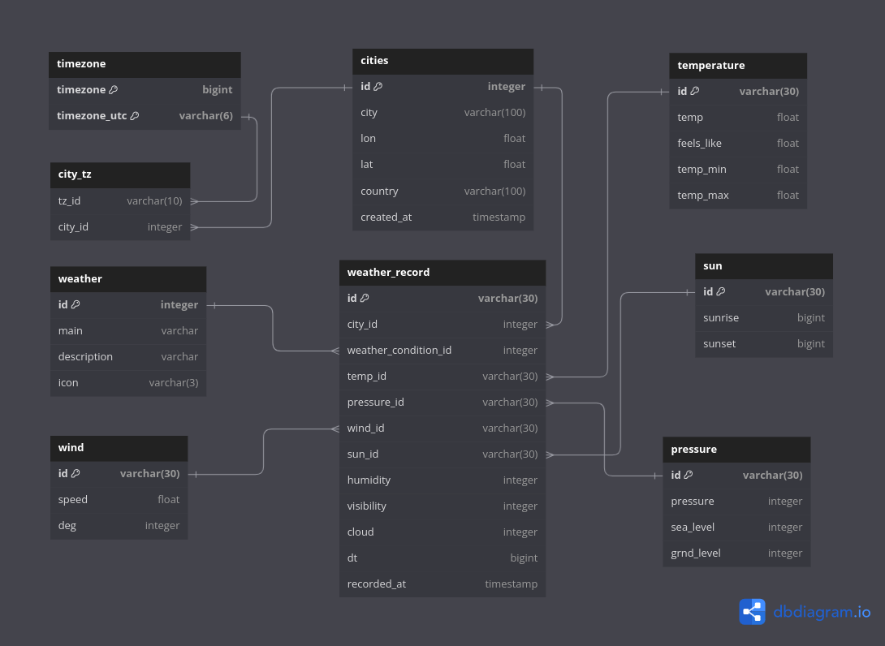
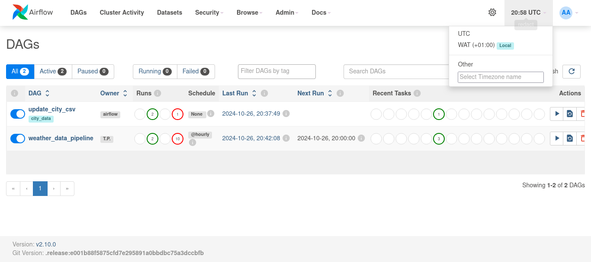
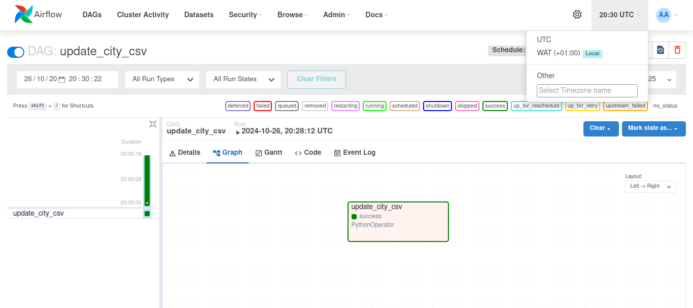
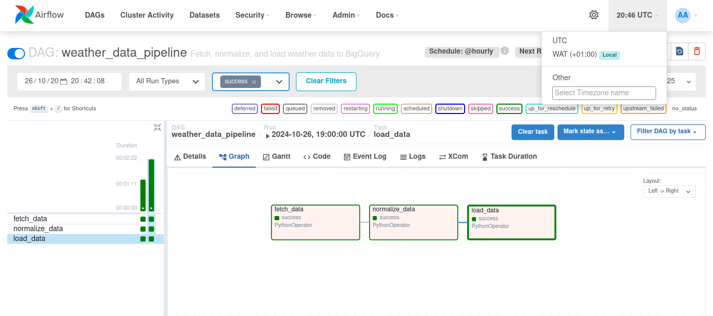
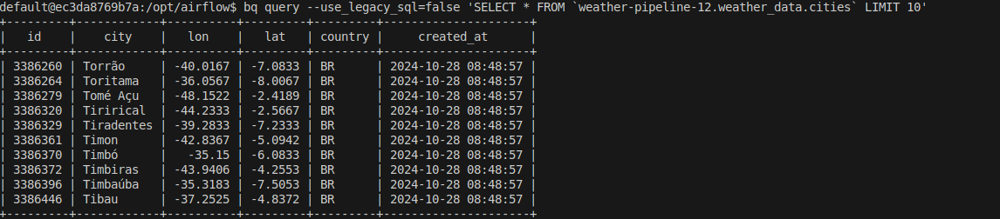
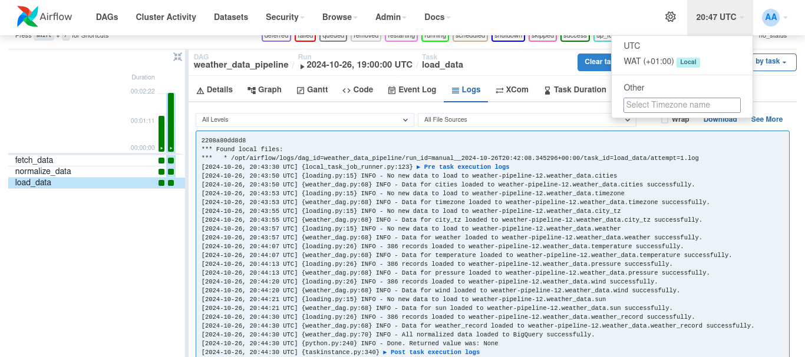

# Weather ETL Pipeline Using Airflow, Docker and BigQuery

This project sets up an **ETL pipeline** using **Apache Airflow** and **BigQuery Sandbox** running in a **Docker** environment. The pipeline retrieves weather data from the **OpenWeatherMap API** for multiple cities, normalizes it up to 3NF, and loads it into several tables in a **BigQuery** dataset.


### Goals
1. To automate the hourly fetching of weather data from an API and the loading of the normalized data into a data warehouse using an Airflow DAG in a containerized  environment.
2. To optimize the weather data fetching process to handle high-volume requests and efficiently manage more cities by:
    - Optimizing data ingestion with controlled API requests and threading.
    - Structuring a normalized data model for efficient querying and storage in BigQuery.


### Features

- **Dockerized Airflow and PostgreSQL**: The project uses Docker and Docker Compose to manage both Airflow and PostgreSQL services.
- **API Data Extraction**: Weather data is fetched using the OpenWeatherMap API.
- **BigQuery**: The data is stored in a BigQuery Dataset.
- **Automated ETL Workflow**: Airflow manages the ETL process, scheduled to run hourly, ensuring that the weather data is updated regularly.
- **Monitoring and Logging**: Airflow's built-in features for monitoring and logging are utilized to track the pipeline workflow.
- **Testing and Dev Support**: The project includes a Makefile with commands to test the entire piple workflow and setup a development environment.


## Execution Plan

The free OpenWeatherMap API allows for  60 requests per minute. And using city ids, weather data for 20 cities can be fetched in one request:
`20 cities *  60 requests/minute = 1200 cities/minute`

To avoid hitting this limit, we will use threading to fetch data for  20 cities at a time, and with a max limit of 1000 city ids. A list of city ids can be gotten from the `city.list.json` file on [OpenWeatherMap](http://bulk.openweathermap.org/sample/).

The fetched data is normalized up to 3NF and  then loaded into BigQuery. And the entire process would  be automated using an Airflow DAG.

### 1. Fetching Process
   - **Create cities file**:
     - Download the `city.list.json` file from OpenWeatherMap, which contains essential information like: `city_id`, `name`, `state`, `country`, `latitude`, `longitude`, and `timezone`. This is done manually.
     - Filter by country codes which are set as an Airflow Variable and load to a `cities.csv` file. File limit is set to 1000 records but can be increased. This process is automated using a `update_city_csv` dag.
     - Set `COUNTRIES`  variable in Airflow to the country codes of interest and trigger the dag to fetch the cities
     - Update city list by editing the `COUNTRIES`  variable in Airflow and retriggering the dag.

   - **Group City IDs for Requests**:
     - Fetch `city_ids` from the `cities.csv` file, split them into groups of 20 (due to the API limit of 20 cities per request).

   - **API Requests**:
     - For each group of 20 cities, send a request to the weather API in a loop, using threading with a rate limit of 60 requests per minute. Each thread should handle up to 10 city requests.
     - If a request fails,  it is retried up to 2 times before moving on to the next group of cities.
     - If rate limit  is hit, the thread sleeps for 1 minute before continuing.

   - **Store Raw Weather Data**:
     - Gather all valid responses into a DataFrame and return  it to the main thread.

### 2. Data Normalization and Loading
   - **Normalize Weather Data**:
     - The raw weather data is then normalized up to 3NF. This involves creating separate tables for `timezone`, `cities`, `city_tz`, `weather_conditions`, `temperature`, `pressure`, `wind`, `sun`, and `weather_record`. The data model can be found here:  [data_model](https://dbdiagram.io/d/weather_model-671cb58f97a66db9a3572de5)
     - The normalized data is then stored in a DataFrame.
   - **Load to BigQuery**:
     - Load each normalized dataframe into BigQuery. This structure will facilitate efficient querying and analysis of weather data.

  **Weather data normalized model**
  


### 3. Orchestrating the Workflow with Airflow DAGs
   - **DAG Structure**:
     - There are two Airflow dags:  `update_city_csv` and `fetch_weather_data`.
     - `update_city_csv` dag fetches the city list and updates the `cities.csv`. This has to be triggered manually.

     - `weather_etl_dag` dag fetches the weather data for the cities in the `cities. The DAG include tasks for each step in the process:
       1. **Fetch Weather Data**: Download weather data for specified cities.
       2. **Transform & Normalize**: Split and structure the data into normalized tables.
       3. **Load to BigQuery**: Load normalized data tables into BigQuery.
   - **Execution Frequency**: The DAG is scheduled to run at hourly intervals for consistent data updates.


### Adding New Cities
   - **Initial Setup**:
     - For the first data ingestion, download the  [city.list.json](http://bulk.openweathermap.org/sample/) file as a source, and run the `update_city_csv`dag.
   - **Adding Additional Countries**:
     - To add a new country manually, add the country code to the`Countries` variable in Airflow.


This structure allows for efficient, organized storage of large-scale weather data, with clearly defined processes for adding new cities from countries, rate-limited data fetching, and BigQuery-based analysis.


## Project Structure

```bash
/weather-etl-Precious/
├── dags/
│   ├── weather_dag.py      # Airflow DAG definition for the ETL process
│   ├── cities_dag.py       # Airflow DAG definition for fetching cities
│   ├── data/               # Folder containing city file
│   └── scripts/            # Folder containing all Python scripts
├── config/
│   └── bigquery-key.json   # Google  Cloud BigQuery API credentials
├── tests/                  # Folder containing all tests
├── Dockerfile              # Dockerfile for configuring the Airflow environment
├── docker-compose.yml      # Docker-Compose file to run Airflow and PostgreSQL
├── requirements.txt        # Python dependencies for the project
├── Makefile                # Makefile for automating tasks
├── .pre-commit-config.yaml # Pre-commit configuration for code quality
├── README.md               # Project documentation
└── .github/workflows       # For Github Actions
```


## Setting up the project on your local machine

### Prerequisites

- **Docker**: Install [Docker]() and [Docker Compose]() on your machine.
- **OpenWeatherMap API**: Sign up for a free API key [here](https://www.google.com/url?q=https%3A%2F%2Fopenweathermap.org%2Fapi).


### Setup Instructions

#### 1. Clone the Repository

Start by cloning the project repository:

```bash
git clone https://github.com/Data-Epic/Weather-ETL-Precious.git
cd Weather-ETL-Precious
```

#### 2. Set up directories and environment variables
To avoid permission issues, you need to [set the airflow user](https://airflow.apache.org/docs/apache-airflow/stable/howto/docker-compose/index.html#setting-the-right-airflow-user). Run this:

```bash
mkdir -p ./dags ./logs ./plugins ./config
echo -e "AIRFLOW_UID=$(id -u)" > .env
```

This would create an  environment variable `AIRFLOW_UID` with the current user ID and save it to .env. By default, it is set to 1000 in the `docker_compose.yml`. You can change it by  setting the user value to the `$AIRFLOW_UID` environment variable.


#### 3. Get OpenWeatherMap API  Key

To fetch weather data, you need an API key from [OpenWeatherMap](https://openweathermap.org/api). Sign up for a free API key and update the `.env` file to include your API key:

```.env
AIRFLOW_UID=your_uid # get by running `id -u`
API_KEY=your_weather_api_key
```

#### 4. Get cities list

You need a list of cities to fetch weather data for. You can get the list from [OpenWeatherMap](http://bulk.openweathermap.org/sample/) by running the command below:
```bash
mkdir -p dags/data && curl -o city.list.json.gz http://bulk.openweathermap.org/sample/city.list.json.gz && gunzip -c city.list.json.gz > dags/data/city.list.json && rm city.list.json.gz
```

#### 5. Build and start containers

Make sure you have **Docker** and **Docker-Compose** installed. Then, build and start the Docker containers:

```bash
docker compose up --build
```

This will initialize the Airflow services like the Airflow webserver.

**Airflow web UI**



#### 6. Running the Project

Once the Docker containers are running, access the Airflow web UI at: [http://localhost:8080](http://localhost:8080).

- Log in with the default credentials (`airflow`/`airflow`).
- For the first run, you need to fetch the cities.
    -  Add your list of countries under Admin > Variables. Example - key: COUNTRIES, value: NG, GH, NG
    -   Go to Admin > DAG Runs and trigger the `update_city_csv` DAG.
    -   Once it is successfully, check the `/dags/data/` folder for the `cities.csv` file.

   **Update city csv DAG**
    

- Navigate to the DAGs section to trigger the `weather_etl_dag`.

  **weather ETL DAG**
   


#### 7. Querying the  BigQuery weather dataset using gcloud cli
To query the BigQuery dataset:
- Open a new terminal window and  run:
 ```bash
 docker compose exec -it airflow-webserver bash
 ```
- Connect to the BigQuery project:
```bash
gcloud auth activate-service-account --key-file=$GOOGLE_APPLICATION_CREDENTIALS
gcloud config set project weather-pipeline-12
```
- Run your queries, for example:
```sql
-- list ten rows in cities table
bq query --use_legacy_sql=false 'SELECT * FROM `weather-pipeline-12.weather_data.cities` LIMIT 10'

-- fetch average temperature for 10 cities in NG
bq query --use_legacy_sql=false 'SELECT wr.id, c.city, AVG(t.temp) AS avg_temp  FROM `weather-pipeline-12.weather_data.weather_record` wr JOIN `weather-pipeline-12.weather_data.cities` c ON wr.city_id = c.id JOIN `weather-pipeline-12.weather_data.temperature` t ON  wr.temp_id = t.id WHERE c.country = "NG" GROUP BY wr.id, c.city ORDER BY avg_temp LIMIT 10'

-- Average Wind Speed for Each City in NG
gcloud bigquery query --use_legacy_sql=false 'SELECT c.city, AVG(w.wind_speed) AS avg_wind_speed FROM `weather-pipeline-12.weather_data.weather_record` wr JOIN `weather-pipeline-12.weather_data.cities` c ON wr.city_id = c.id JOIN `weather-pipeline-12.weather_data.wind` w ON wr.wind_id = w.id WHERE c.country = "NG" GROUP BY c.city ORDER BY avg_wind_speed DESC'
```
-  Exit the shell:
```
exit
```

**Result for querying cities table**:
  


#### 7. Shutting down services and Cleaning up
To stop the services, run:

```bash
docker compose down
```

To stop and delete containers, delete volumes with database data and download images, run:

```bash
docker compose down --volumes --rmi all
```

This helps when there's a problem or you want to run a fresh set up.


## Airflow DAGs

The core logic of the ETL process is managed by the **weather_etl_dag** created by `dags/weather_dag.py`. The DAG is scheduled to run every hour, fetching weather data for multiple cities, normalizing it and loading it to BigQuery.


### DAG Workflow:
1. Fetch weather data from the OpenWeatherMap API for a list of city ids from `dags/data/city.csv`.
3. Normalize weather data up to 3NF, getting 9 tables.
4. Load the data into the BigQuery dataset.

### DAG Code: Excerpt from `weather_dag.py`

```python
# import dependecies
.....

# Default arguments for the DAG
default_args = {
    'owner': 'Airlow',
    'depends_on_past': False,
    'retries': 1,
    'retry_delay': timedelta(minutes=5),
}

def fetch_data_task(**kwargs):
 ....

def normalize_data_task(**kwargs):
    ...

def load_data_task(**kwargs):
    ...

with DAG(
    dag_id='weather_etl_dag',
    default_args=default_args,
    description='Fetch, normalize, and load weather data to BigQuery',
    schedule_interval='@hourly',  # Adjust the schedule as needed
    start_date=days_ago(1),
    catchup=False,
) as dag:

    fetch_data = PythonOperator(
        task_id='fetch_data',
        python_callable=fetch_data_task,
        provide_context=True
    )

    normalize_data = PythonOperator(
        task_id='normalize_data',
        python_callable=normalize_data_task,
        provide_context=True
    )

    load_data = PythonOperator(
        task_id='load_data',
        python_callable=load_data_task,
        provide_context=True
    )


    fetch_data >> normalize_data >> load_data
```


## Continuous Integration and Testing

### Github Actions
The project includes a **github actions CI/CD pipeline** that ensures the following:
- **Linting, formatting and type checking**: The Python code follows PEP8 standards and is checked using pre-commit hooks (extras: ruff and mypy).
- **Automated Tests**: The project has unit tests to ensure the integrity of the ETL process, as well as test dags runs.

### Makefile
The project also consists of a Makefile with commands for setting up a test environment, running tests, and linting.

**Makefile Commands**:
```
make help           - Shows available commands
make setup          - Setup test environment and install depencies
make pre-commit     - Run pre-commit checks for linting, formatting and type checking
make airflow-test	- Test Airflow DAG
make pytest		    - Run unit tests
make test           - Run unit tests and airflow tests
make clean			- Clear temp and test directories"
make all-checks	    - Run all checks and clean up"
```
### Logging

Airflow logs are saved to `logs/` folder and also displayed in the console and web UI.

**Logs for successful loading task**


## Contributing
Contributions are welcome! Please fork the repository and submit a pull request with your proposed changes.

## Acknowledgment
This project was created as part of the [Data Epic Mentorship program](https://github.com/Data-Epic/) data engineering projects.
